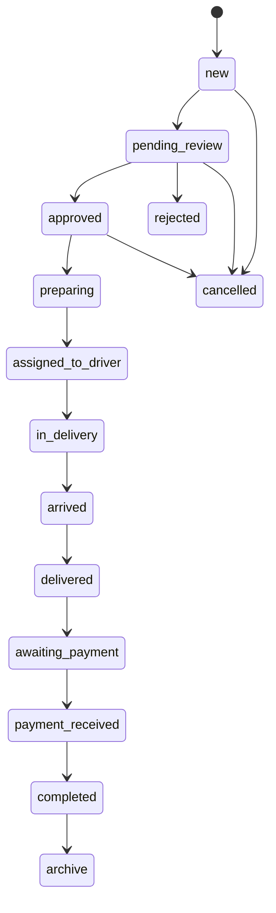

# TopDent

**TopDent** is an RTL Arabic marketplace for dental products and services. It supports reviewed company storefronts, new and used product listings, multi-merchant checkout, delivery operations, rentals, dental-card design requests, offers, and role-aware operational dashboards.

> The application is designed around explicit status transitions, immutable price/delivery snapshots, and Supabase-hosted durable media rather than mock data or a local upload directory.

## Architecture

| Layer | Technology | Responsibility |
|---|---|---|
| Client | Next.js 14, React, Tailwind CSS | RTL storefront, shopping flow, product submissions, service requests, and dashboards |
| API | Node.js, Express, Zod | Authentication, role-based authorization, validation, workflow transitions, checkout, and operations |
| Data | Supabase PostgreSQL | Relational commerce data, audit trail, status history, snapshots, reporting, and workflows |
| Media | Supabase Storage | Validated, resized WebP images with asset tracking and orphan cleanup |
| Email | SMTP via Nodemailer | Password reset messages when SMTP is configured |

## Core workflow model

The checkout endpoint creates one **parent order** for the customer and one **merchant order** per seller. Product prices, SYP equivalents, USD conversion rate, delivery pricing, and recipient details are persisted as order snapshots. The system reserves stock atomically per product using PostgreSQL functions; it restores stock when an eligible merchant order is rejected or cancelled.

Merchant orders use the following controlled path:



The API verifies every transition against the actor role. Customers may cancel eligible early-stage orders, merchants can prepare only their own orders, managers approve/reject/assign and confirm cash receipt, drivers update delivery evidence and cash collection, and administrators have full supervisory access.

## Database migrations

The original schema is preserved in `server/src/db/migrations.sql`. New idempotent, versioned migrations are applied after it:

1. `001_platform_workflows.sql` adds the role, approval, rich product, order hierarchy, snapshots, delivery, promotions, rentals, media, audit, and service-request schema.
2. `002_inventory_reservation.sql` adds atomic stock reserve/release functions.
3. `003_media_assets.sql` tracks durable uploaded objects and their ownership.
4. `004_discount_redemption.sql` consumes discount use atomically and prevents quota races.
5. `005_personal_sellers.sql` supports customer-owned used-product listings.

Apply migrations using a Supabase service role key:

```bash
npm --prefix server run migrate
```

The runner records checksums in `schema_migrations`, so it refuses altered previously-applied migration files.

## Local setup

### 1. Install dependencies

```bash
npm ci
npm --prefix server ci
npm --prefix client ci
```

### 2. Configure environment

Copy `.env.example` to `.env` and provide actual Supabase credentials. Do **not** commit `.env` files, SMTP passwords, service keys, deployment URLs, or bootstrap credentials.

```bash
cp .env.example .env
```

Required API variables are `SUPABASE_URL`, `SUPABASE_ANON_KEY`, `SUPABASE_SERVICE_KEY`, and a strong `JWT_SECRET` of at least 32 characters. `CORS_ORIGINS` must contain the precise comma-separated frontend origins. In production, use a dedicated service key with minimal administrative access and rotate it if exposed.

### 3. Apply schema and bootstrap the first administrator

```bash
npm --prefix server run migrate
ADMIN_EMAIL=admin@example.com ADMIN_PASSWORD='use-a-long-unique-password' ADMIN_NAME='TopDent Admin' npm --prefix server run seed:admin
```

The bootstrap command creates an administrator if it does not exist; otherwise it promotes that existing account. It requires the actual Supabase configuration in `.env`.

### 4. Run services

```bash
npm run dev:server
NEXT_PUBLIC_API_URL=http://localhost:3000/api npm run dev:client
```

The client never has a hard-coded production API URL. Set `NEXT_PUBLIC_API_URL` on the hosting platform to the deployed API URL followed by `/api`.

## Verification

```bash
npm run check
npm test
npm run build
```

The smoke suite verifies health isolation, strict CORS, request validation, mandatory JWT configuration, commerce validation invariants, and role-specific order workflow transitions. A complete live integration run additionally requires a real Supabase project with the migrations applied.

## Deployment plan

### Supabase

1. Create a production Supabase project and save `SUPABASE_URL`, public anon key, and service-role key in the backend host’s encrypted environment settings.
2. Run `npm --prefix server run migrate` once with the service-role key.
3. Ensure the API service role is the only server-side credential. The frontend only consumes public Storage URLs returned by the API.
4. The `topdent-media` bucket is created lazily by the upload endpoint as a public bucket. Uploaded files are accepted only after magic-byte type detection, resized to WebP, and recorded in `media_assets`.

### Railway or Render API

Deploy the repository’s backend with the root `Dockerfile.server` or the backend service definition. Set these environment values in the platform dashboard:

```text
NODE_ENV=production
PORT=<platform-provided-port>
SUPABASE_URL=...
SUPABASE_ANON_KEY=...
SUPABASE_SERVICE_KEY=...
JWT_SECRET=...
CORS_ORIGINS=https://your-client-domain.example
SMTP_HOST=...                 # optional until password reset email is enabled
SMTP_PORT=587
SMTP_USER=...
SMTP_PASSWORD=...
MAIL_FROM=...
```

Health check path: `/health`.

### Vercel client

Deploy the `client` directory as a Next.js project. Set:

```text
NEXT_PUBLIC_API_URL=https://your-api-domain.example/api
```

After the Vercel deployment URL is known, add it to the backend `CORS_ORIGINS` and redeploy the API. Add the custom production domain as another exact CORS origin before enabling traffic.

## Security controls

| Control | Implementation |
|---|---|
| Authentication | Bcrypt password hashes, JWT expiration, token validity field, last-login updates |
| Authorization | Central role middleware plus resource ownership checks for products, orders, cart, favorites, uploads, and media assets |
| Input validation | Strict Zod schemas for parameters, query strings, and request bodies |
| API hardening | Helmet, exact-origin CORS allowlist, global and auth-specific rate limits, request size limits, non-sensitive structured logs |
| Durable uploads | Multer memory limits, magic-byte detection, Sharp resize/recompression, Supabase Storage paths, owner-tracked media records |
| Auditability | Activity log, status history, driver assignments, delivery pricing history, external-payment review records, product reports |
| Financial integrity | Per-order snapshots, restricted status transitions, atomic stock decrement/release and discount redemption functions |

## Operational notes

- Configure company delivery rates for normal, urgent, and very urgent delivery before checkout. Each speed has separate same-province and out-of-province rates.
- Activate the desired social, contact, and `about_text` settings from the administration API/dashboard before launch. The public footer only renders real URLs, never fake placeholder links.
- Use `POST /api/upload/cleanup-orphans` as an administrator to delete unattached images older than the specified threshold. The endpoint is deliberately explicit rather than silently deleting user-uploaded files.
- External transfers are recorded as verification tasks for administrators. The system does not implement an internal wallet or wallet balance.
- For repeatable testing or local database development, use a separate Supabase project; do not place test service keys in the source tree.

## Repository structure

```text
client/                  Next.js Arabic RTL client
server/src/routes/       Express route modules
server/src/lib/          API, mail, storage, and order-workflow helpers
server/src/db/           base migration, versioned migrations, runner, admin seed
server/src/validation/   strict Zod request contracts
server/test/             smoke and workflow tests
```
