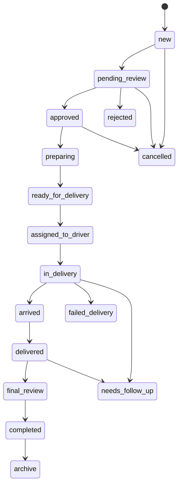

# TopDent

**TopDent** is an RTL Arabic marketplace for dental products and services. It supports reviewed company storefronts, new and used product listings, multi-merchant checkout, delivery operations, rentals, dental-card design requests, offers, and role-aware operational dashboards.

> The application is designed around explicit status transitions, immutable price/delivery snapshots, and Supabase-hosted durable media rather than mock data or a local upload directory.

## Architecture

| Layer | Technology | Responsibility |
|---|---|---|
| Client | Next.js 14, React, Tailwind CSS | RTL storefront, shopping flow, product submissions, service requests, and dashboards |
| API | Node.js, Express, Zod | Authentication, RBAC/Scope authorization, validation, workflow transitions, checkout, and operations |
| Data | Supabase PostgreSQL | Relational commerce data, audit trail, status history, snapshots, reporting, and workflows |
| Media | Supabase Storage | Validated, resized WebP images with asset tracking and orphan cleanup |
| Email | SMTP via Nodemailer | Password reset messages when SMTP is configured |

## Core workflow model

The checkout endpoint creates one **parent order** for the customer and one **merchant order** per seller. Product prices, SYP equivalents, USD conversion rate, delivery pricing, and recipient details are persisted as order snapshots. The system reserves stock atomically per product using PostgreSQL functions; it restores stock when an eligible merchant order is rejected or cancelled.

Merchant orders use the following controlled path:


```mermaid
stateDiagram-v2
  [*] --> new
  new --> pending_review
  pending_review --> approved
  pending_review --> rejected
  approved --> preparing
  preparing --> ready_for_delivery
  ready_for_delivery --> assigned_to_driver
  assigned_to_driver --> in_delivery
  in_delivery --> arrived
  arrived --> delivered
  delivered --> final_review
  final_review --> completed
  completed --> archive
  new --> cancelled
  pending_review --> cancelled
  approved --> cancelled
  in_delivery --> failed_delivery
  in_delivery --> needs_follow_up
  delivered --> needs_follow_up
```

The API verifies every transition against the actor's **effective permissions and scope**, not merely the historical primary role. Customers may cancel eligible early-stage orders, company users work only within their assigned company, drivers can operate only their assigned orders, and `platform_owner` is the audited emergency override. Legacy `awaiting_payment` and `payment_received` transitions remain only as safe compatibility bridges for pre-upgrade orders.

## RBAC, scopes, and account status

`006_rbac_permissions.sql` introduces an additive authorization model. Existing `users.role` remains in place for compatibility, but all new platform APIs use the effective session model below:

```text
User + active account status + active role assignment + explicit permissions + scope + company assignment
```

| System role | Scope | Default behavior |
|---|---|---|
| `platform_owner` | Global | Protected bootstrap-only owner; bypass is logged. It cannot be public-registered, disabled, downgraded, or assigned over the API. |
| `platform_admin` | Global | No automatic permissions. The owner assigns explicit permissions. |
| `company_manager` | One company | Operational product, order, team, driver, and finance access for the assigned company only. |
| `company_admin` | One company | Starts without operational permissions; the company manager grants only required access. |
| `platform_driver` | Global assignment, assigned orders only | Can operate assigned delivery tasks; no administrative rights. |
| `company_driver` | One company, assigned orders only | Cannot view or operate another company's orders. |
| `customer` | Self | Storefront, cart, own orders, favorites, services, and personal listings. |

An active role assignment has `scope_type` of `global` or `company`; company roles must include a company ID. The API rejects cross-company direct URLs with `403`. Accounts use `active`, `inactive`, `suspended`, or `pending`; anything except `active` is rejected immediately by token verification. The `is_active` field remains synchronized for older routes.

The role matrix is stored in `roles`, `permissions`, `role_permissions`, and `user_role_assignments`. The migration seeds the requested permissions (for example `orders.approve`, `finance.confirm_payment`, and `audit.view`) and creates a temporary `legacy_platform_operator` only for pre-existing legacy `admin` accounts, preserving currently deployed capabilities without giving new platform administrators automatic access.

## Database migrations

The original schema is preserved in `server/src/db/migrations.sql`. New idempotent, versioned migrations are applied after it:

1. `001_platform_workflows.sql` adds the role, approval, rich product, order hierarchy, snapshots, delivery, promotions, rentals, media, audit, and service-request schema.
2. `002_inventory_reservation.sql` adds atomic stock reserve/release functions.
3. `003_media_assets.sql` tracks durable uploaded objects and their ownership.
4. `004_discount_redemption.sql` consumes discount use atomically and prevents quota races.
5. `005_personal_sellers.sql` supports customer-owned used-product listings.
6. `006_rbac_permissions.sql` adds RBAC, company scope, account lifecycle, protected owner assignments, driver types, delivery issues, invoice snapshots, and auditable collection confirmation.

Apply migrations using a Supabase service role key:

```bash
npm --prefix server run migrate
```

The runner records checksums in `schema_migrations`, so it refuses altered previously-applied migration files.

## Local setup

### 1. Install dependencies

```bash
npm ci
npm --prefix server ci
npm --prefix client ci
```

### 2. Configure environment

Copy `.env.example` to `.env` and provide actual Supabase credentials. Do **not** commit `.env` files, SMTP passwords, service keys, deployment URLs, or bootstrap credentials.

```bash
cp .env.example .env
```

Required API variables are `SUPABASE_URL`, `SUPABASE_ANON_KEY`, `SUPABASE_SERVICE_KEY`, and a strong `JWT_SECRET` of at least 32 characters. `CORS_ORIGINS` must contain the precise comma-separated frontend origins. In production, use a dedicated service key with minimal administrative access and rotate it if exposed.

### 3. Apply schema and bootstrap the first Platform Owner

```bash
npm --prefix server run migrate
PLATFORM_OWNER_EMAIL=owner@example.com PLATFORM_OWNER_PASSWORD='a-long-unique-secret-of-at-least-16-characters' PLATFORM_OWNER_NAME='مالك TopDent' npm --prefix server run seed:owner
```

The bootstrap command creates the first protected owner if it does not exist, or safely reactivates the same bootstrap identity. It refuses to create a second owner unless the documented recovery environment flag is deliberately set. Never add bootstrap credentials to `.env.example`, source files, commits, or tickets.

### 4. Run services

```bash
npm run dev:server
NEXT_PUBLIC_API_URL=http://localhost:3000/api npm run dev:client
```

The client never has a hard-coded production API URL. Set `NEXT_PUBLIC_API_URL` on the hosting platform to the deployed API URL followed by `/api`.

## Verification

```bash
npm run check
npm test
npm run build
```

The test suite verifies health isolation, strict CORS, request validation, mandatory JWT configuration, commerce validation invariants, legacy-safe workflow transitions, role-independent RBAC permission resolution, company-scope isolation, and final-review order behavior. A complete live integration run additionally requires a real Supabase project with the migrations applied.

## Platform management API

All `/api/platform/*` routes require a verified active account and a matching backend permission; hiding an item in the dashboard is never authorization. Key routes are:

| Area | Routes |
|---|---|
| Dashboard and reports | `GET /api/platform/dashboard`, `GET /api/platform/reports?format=csv` |
| Companies and users | `GET/POST /api/platform/companies`, `GET/PATCH /api/platform/companies/:id`, `PATCH /api/platform/companies/:id/status`, `GET/POST /api/platform/users`, `PATCH /api/platform/users/:id/status` |
| Roles | `GET/POST /api/platform/roles`, `PATCH /api/platform/roles/:id`, `PUT /api/platform/roles/:id/permissions`, `POST /api/platform/roles/assign` |
| Products | `GET /api/platform/products`, `PATCH /api/platform/products/:id`, `PATCH /api/platform/products/:id/status`, plus scoped company product creation through `POST /api/products` |
| Orders and delivery | `GET /api/platform/orders`, `PATCH /api/platform/orders/:id/status`, `POST /api/platform/orders/:id/assign-driver`, `POST /api/platform/orders/:id/issues` |
| Finance and audit | `GET /api/platform/collections`, `POST /api/platform/collections/:id/confirm`, `GET /api/platform/invoices`, `GET /api/platform/invoices/:id/export`, `GET /api/platform/audit-log` |
| Notifications and settings | `POST /api/platform/notifications`, `GET/PATCH /api/platform/settings` |

`GET /api/platform/invoices/:id/export` and `GET /api/platform/reports?format=csv` provide CSV exports. Invoices are generated from immutable order/item snapshots when a merchant order reaches `completed`.

## Deployment plan

### Supabase

1. Create a production Supabase project and save `SUPABASE_URL`, public anon key, and service-role key in the backend host’s encrypted environment settings.
2. Run `npm --prefix server run migrate` once with the service-role key.
3. Ensure the API service role is the only server-side credential. The frontend only consumes public Storage URLs returned by the API.
4. The `topdent-media` bucket is created lazily by the upload endpoint as a public bucket. Uploaded files are accepted only after magic-byte type detection, resized to WebP, and recorded in `media_assets`.

### Railway or Render API

Deploy the repository’s backend with the root `Dockerfile.server` or the backend service definition. Set these environment values in the platform dashboard:

```text
NODE_ENV=production
PORT=<platform-provided-port>
SUPABASE_URL=...
SUPABASE_ANON_KEY=...
SUPABASE_SERVICE_KEY=...
JWT_SECRET=...
CORS_ORIGINS=https://your-client-domain.example
SMTP_HOST=...                 # optional until password reset email is enabled
SMTP_PORT=587
SMTP_USER=...
SMTP_PASSWORD=...
MAIL_FROM=...
```

Health check path: `/health`.

### Vercel client

Deploy the `client` directory as a Next.js project. Set:

```text
NEXT_PUBLIC_API_URL=https://your-api-domain.example/api
```

After the Vercel deployment URL is known, add it to the backend `CORS_ORIGINS` and redeploy the API. Add the custom production domain as another exact CORS origin before enabling traffic.

## Security controls

| Control | Implementation |
|---|---|
| Authentication | Bcrypt password hashes, JWT expiration, token validity field, last-login updates |
| Authorization | Central role middleware plus resource ownership checks for products, orders, cart, favorites, uploads, and media assets |
| Input validation | Strict Zod schemas for parameters, query strings, and request bodies |
| API hardening | Helmet, exact-origin CORS allowlist, global and auth-specific rate limits, request size limits, non-sensitive structured logs |
| Durable uploads | Multer memory limits, magic-byte detection, Sharp resize/recompression, Supabase Storage paths, owner-tracked media records |
| Auditability | Activity log, status history, driver assignments, delivery pricing history, external-payment review records, product reports |
| Financial integrity | Per-order snapshots, restricted status transitions, atomic stock decrement/release and discount redemption functions |

## Operational notes

- Configure company delivery rates for normal, urgent, and very urgent delivery before checkout. Each speed has separate same-province and out-of-province rates.
- Activate the desired social, contact, and `about_text` settings from the administration API/dashboard before launch. The public footer only renders real URLs, never fake placeholder links.
- Use `POST /api/upload/cleanup-orphans` as an administrator to delete unattached images older than the specified threshold. The endpoint is deliberately explicit rather than silently deleting user-uploaded files.
- External transfers are recorded as verification tasks for administrators. The system does not implement an internal wallet or wallet balance.
- For repeatable testing or local database development, use a separate Supabase project; do not place test service keys in the source tree.

## Repository structure

```text
client/                  Next.js Arabic RTL client
server/src/routes/       Express route modules
server/src/lib/          API, mail, storage, and order-workflow helpers
server/src/db/           base migration, versioned migrations, runner, admin seed
server/src/validation/   strict Zod request contracts
server/test/             smoke and workflow tests
```
